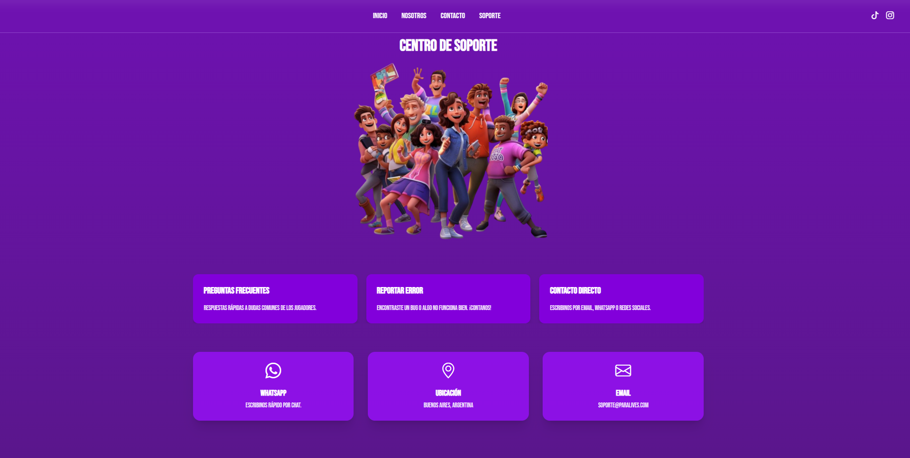

# Paralives React

Proyecto de frontend desarrollado con React y Vite para la landing page de Paralives Games.
<p align="center">
  
</p>

## Descripción

Esta aplicación es una landing page responsiva y moderna, creada con React y estilizada con CSS y Bootstrap.  
Está optimizada para producción usando Vite como bundler.

## Tecnologías usadas

- React 18
- Vite
- CSS / Bootstrap
- Git y GitHub para control de versiones
- Netlify para hosting y despliegue continuo

## Visítanos en nuestro sitio web
 https://paralivesgames.netlify.app/ 

<p align="center">
  
</p>
<p align="center">
  
</p>
<p align="center">
  
</p>
<p align="center">
  
</p>

 
## Instalación

1. Clonar el repositorio

```bash
git clone https://github.com/MicaelaMarg/paralives-react.git
